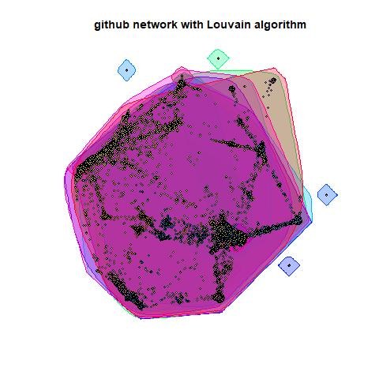

```{r setup, include=FALSE}
knitr::opts_chunk$set(
collapse = TRUE,
comment = '#>',
fig.path = './figures/'
)
knitr::knit_engines$set(julia = JuliaCall::eng_juliacall)
options(JULIA_HOME = '/home/dreth/julia/bin')
```

```{r, echo=FALSE, warning=FALSE, message=FALSE}
library(igraph)
```

# Part 1

## Description of the network

Our dataset corresponds to the [GitHub.com](https://github.com) network of developers. This data was collected from the public API in June 2019. Each node is a developer with at least 10 repositories starred and each edge is a mutual follower relationship between them. The vertex features are extracted based on the location, repositories starred, employer and e-mail address.

## Source

The dataset was optained from the [Stanford University SNAP website.](http://snap.stanford.edu/data/github-social.html). This dataset originally come from a paper published the 28th of september, 2019 called [Multi-scale Attributed Node Embedding](https://arxiv.org/abs/1909.13021). The github repository for that project can be found [here](https://github.com/benedekrozemberczki/MUSAE).

## Characteristics of the network

```{r, echo=FALSE, warning=FALSE, message=FALSE}
nodes <- read.csv('../data/git_web_ml/musae_git_target.csv', header=T, as.is=T)
edges <- read.csv('../data/git_web_ml/musae_git_edges.csv', header=T, as.is=T)
github <- graph_from_data_frame(d=edges, vertices=nodes, directed=F)
```

### Vertices/Nodes

Our network has the following amount of vertices/nodes:

\small

```{r, echo=FALSE, warning=FALSE, message=FALSE}
gorder(github)
```

\normalsize

#### Degrees of vertices

##### Top vertex degrees 

The vertices with the largest degrees (top 5) are:

\small

```{r, echo=FALSE, warning=FALSE, message=FALSE}
sort(degree(github), decreasing=T)[1:5]
```

\normalsize

\newpage

##### Who are they?

As these are individuals, we could peak inside GitHub.com and check the public profile of these individuals.

- Top user: **dalinhuang99**

The reason why this user might have so many followers could be the fact that he's followed a very large amount of users (160k as of May 4th 2021).

The user also seems to be a top 4% Stack overflow participant. However, the user has had no activity since July 17th 2018.

- Second top user: **nfultz**

This next user seems to have several useful tutorials/content in his github pages hosted static site. Also seems to have several active repositories where the user does some collaborative work.

There is no immediate apparent reason as to why the user has garnered such a large following.

- Third top user: **addyosmani**

This user has actually garnered a larger following than shown on the dataset. The user is an engineer at Google, working specifically on Google Chrome and the user has a significantly larger following on other social media (259.5k on twitter).

- Fourth top user: **Bunlong**

The user seems to be very active on github, committing code basically every day. The user also follows about 24.4k other users, and has created a couple projects that seem to be somewhat public as well.

- Fifth top user: **gabrielpconceicao**

The user also seems to be following a very large amount of users (31.8k following), not as active as the rest in the list, so the amount of followers could've come from following a large amount as well.

\newpage

##### Bottom vertex degrees

The following amount of users have a degree of exactly 1 (one follower):

```{r, echo=FALSE, warning=FALSE, message=FALSE}
length(degree(github)[degree(github) == 1])
```

##### Sum of vertex degrees 

Calculated as follows:

$$\sum_{v=1}^{N} d_v = 2L$$ 

Corresponds to twice the size of the graph:

```{r, echo=FALSE, warning=FALSE, message=FALSE}
sum(degree(github))
```

##### Average degree

Calculated as follows:

$$\frac{1}{N} * \sum_{v=1}^{N} d_v = 2\frac{L}{N}$$

Represents the average amount of mutual followers among all users in the network (nodes):

```{r, echo=FALSE, warning=FALSE, message=FALSE}
mean(degree(github))
```

##### Degree distribution

We can see the degree distribution of our graph as follows:

```{r, echo=FALSE, warning=FALSE, message=FALSE, fig.width=10, fig.height=4.5}
tbl <- table(degree(github))
plot(tbl/(sum(tbl)), col='blue', main='Degree distribution of the github network', xlab='Degree', ylab='Frequency', type='h')
```

We can notice that our degree distribution is extremely right-skewed.

The reason for this we can clearly see by looking at a table of our degree frequencies (top 10):

\small

```{r, echo=FALSE, warning=FALSE, message=FALSE}
tbl[1:10]
```

\newpage

We can see the rightmost tail of our plot (top 50 frequencies), excluding the biggest outliers.

Here we can see a bit over 95% of the data points in our graph:

&nbsp;

```{r, echo=FALSE, warning=FALSE, message=FALSE, fig.width=10, fig.height=10}
plot(tbl[1:50]/(sum(tbl[1:50])), col='blue', main='Degree distribution of the github network (excluding outliers)', xlab='Degree', ylab='Frequency', type='h')
```

\newpage

We can also create a histogram and density of our degree distributions, but for practicality and visual purposes, we avoid plotting any frequency above 46 edges.

&nbsp;

```{r, echo=FALSE, warning=FALSE, message=FALSE, fig.width=10, fig.height=10}
par(mfrow=c(2,1))
degs <- degree(github)
hist(degs[degs <= 46], breaks=10, main='Histogram for degrees with <46 edges (95% of the data)')
plot(density(degs[degs <= 46]), main='Density plot for the previous histogram')
```

\newpage

### Edges/Links

Our network has the following amount of edges (the size of the graph):

\small

```{r, echo=FALSE, warning=FALSE, message=FALSE}
gsize(github)
```

\normalsize

The edges of the GitHub network are not weighted, because the edges represent a mutual follower relationship on GitHub, which would essentially always have a weight of 1. 

Additionally, our network does not have any loop, therefore it's not a multigraph. 

### Connectedness

We can notice that our graph is connected, therefore every vertex is reachable from every other:

```{r, echo=FALSE, warning=FALSE, message=FALSE}
is_connected(github)
```

### Diameter

Diameter is the shortest distance between the two most distant nodes in the network and with the *diameter* function we can obtain the value of the longest geodesic distance in the network.

This diameter corresponds to the following set of 12 nodes:

```{r, echo=FALSE, warning=FALSE, message=FALSE, eval=FALSE}
get_diameter(github)
diameter(github)
```

**haochenli** --> **ChiuMungZitAlexander** --> **IrvingZha0** --> **harryworld** --> **NigelEarle** --> **getify** --> **indrajithbandara** --> **kaizenagility** --> **artificialsoph** --> **kemacdonald** --> **jpriniski** --> **SOUMAJYOTI**

With a diameter of 11 (longest geodesic distance).

#### Farthest vertices

The farthest vertices corresponds to the previously mentioned first and last node, which are:

```{r, echo=FALSE, warning=FALSE, message=FALSE, eval=FALSE}
farthest_vertices(github)
```

- Start: **haochenli**

- End:  **SOUMAJYOTI**

#### Adjacency Matrix

For size purposes, it makes no sense to show the adjancency matrix of this network, as it would turn out to be a matrix of size 37,700 by 37,700.

\newpage

## Graphical representations

We have learned several methods to generate graphical representations of graphs, but none of them can be used directly for a big network. Unfortunately, our graph has 37.7k nodes and 298k edges, which is a rather large graph.

So we can only make a subgraph of the first 400 nodes and those edges with these nodes. If we choose more nodes, the graph will be too crowded, if we choose less nodes, the graph will possibly contains too few edges.

But we can hardly find useful information from these plots.

So the analysis is only attached to the subgraph itself but not the original big network.

```{r, echo=FALSE, warning=FALSE, message=FALSE}
g_sub=subgraph.edges(github,1:400,1:400)
```

We have taken the liberty to plot a slightly more complex graph than the one shown in the presentation, as we had more time for processing.

The graph's connectedness is unfortunately not perfectly showcased for this subgraph.

\newpage

### Circular layout

The circular and star layouts appear to confirm that the number of edges is not very large. This is a **sparse network**,relatively small compared with the number of vertices.
&nbsp;

```{r, echo=FALSE, warning=FALSE, message=FALSE, fig.width=10, fig.height=10}
plot.igraph(g_sub,layout=layout_in_circle,main="Circular layout", vertex.label=NA, vertex.size=2)
```

\newpage

### Star layout
&nbsp;

```{r, echo=FALSE, warning=FALSE, message=FALSE, fig.width=10, fig.height=10}
plot.igraph(g_sub,layout=layout_as_star,main="Star layout", vertex.label=NA, vertex.size=2)
```

\newpage

### Tree layout
&nbsp;
```{r, echo=FALSE, warning=FALSE, message=FALSE, fig.width=10, fig.height=10}
plot.igraph(g_sub,layout=layout_as_tree,main="Tree layout", vertex.label=NA, vertex.size=2)
```

\newpage

### Grid layout
&nbsp;

```{r, echo=FALSE, warning=FALSE, message=FALSE, fig.width=10, fig.height=10}
plot.igraph(g_sub,layout=layout_on_grid,main="Grid layout", vertex.label=NA, vertex.size=2)
```

\newpage

### Sphere layout
&nbsp;

```{r, echo=FALSE, warning=FALSE, message=FALSE, fig.width=10, fig.height=10}
plot.igraph(g_sub,layout=layout_on_sphere,main="Sphere layout", vertex.label=NA, vertex.size=2)
```

\newpage

### Davidson-Harel layout
&nbsp;

```{r, echo=FALSE, warning=FALSE, message=FALSE, cache=TRUE, fig.width=10, fig.height=10}
plot.igraph(g_sub,layout=layout_with_dh, vertex.label=NA, vertex.size=2)
```

\newpage

### Fruchtermann-Reingold layout
&nbsp;

```{r, echo=FALSE, warning=FALSE, message=FALSE, fig.width=10, fig.height=10}
plot.igraph(g_sub,layout=layout_with_fr,main="Fruchterman-Reingold layout", vertex.label=NA, vertex.size=2)
```

\newpage

### GEM force-directed layout
&nbsp;

```{r, echo=FALSE, warning=FALSE, message=FALSE, fig.width=10, fig.height=10}
plot.igraph(g_sub,layout=layout_with_gem,main="GEM force-directed layout", vertex.label=NA, vertex.size=2)
```

\newpage

### Graphopt layout
&nbsp;

```{r, echo=FALSE, warning=FALSE, message=FALSE, fig.width=10, fig.height=10}
plot.igraph(g_sub,layout=layout_with_graphopt,main="Graphopt layout", vertex.label=NA, vertex.size=2)
```

\newpage

### Kamada-Kawai layout
&nbsp;

```{r, echo=FALSE, warning=FALSE, message=FALSE, fig.width=10, fig.height=10}
plot.igraph(g_sub,layout=layout_with_kk,main="Kamada-Kawai layout", vertex.label=NA, vertex.size=2)
```

\newpage

### Multidimensional Scaling layout
&nbsp;

```{r, echo=FALSE, warning=FALSE, message=FALSE, fig.width=10, fig.height=10}
plot.igraph(g_sub,layout=layout_with_mds,main="Multidimensional scaling layout", vertex.label=NA, vertex.size=2)
```

\newpage

### Our choice to represent the graph

We choose to use Davidson-Harel layout, since there and only two type of nodes, the user is a web or  machine learning developer, we wish to identify them with shapes and colors. And we adjust the size of nodes and edges to make the plot clearer.
&nbsp;

```{r, echo=FALSE, warning=FALSE, message=FALSE, fig.width=10, fig.height=10}
V(g_sub)$shape <- "circle"
V(g_sub)[V(g_sub)$ml_target==1]$shape<- "rectangle"

V(g_sub)[V(g_sub)$ml_target==1]$color<- 'yellow'
V(g_sub)[V(g_sub)$ml_target==0]$color<- 'blue'

E(g_sub)$width=1

plot.igraph(g_sub,layout=layout_with_dh,main="Davidson-Harel layout",vertex.label=NA, vertex.size=2)
```

# Part 2

## Section 1: Centrality measures

## Centrality measures

The first thing we shall do in part 2 is obtain the centrality measures for our network. 

### Vertex degree

As we saw before, according to vertex degree, which is technically a very simple but still quite informative centrality measure. We see that the top vertices are as follows:

```{r, echo=FALSE, warning=FALSE, message=FALSE}
github_verts <- sort.int(degree(github), decreasing=TRUE, index.return=TRUE)
github_verts$x[1:5]
```

Given that the network is not directed or weighted, the measures utilizing *strength* will be equal to those of using *degree*, therefore our top 5 remains the same from either perspective.

### Closeness centrality

Given the size of our graph and the computational intensity of the calculation of certain centrality measures like closeness centrality, we will take a subgraph of our graph using *subgraph.edges*, which preserves a given amount of edges along with vertices.

```{r, echo=FALSE, warning=FALSE, message=FALSE}
g_sub <- subgraph.edges(github, 1:10000, 1:5000)
g_closeness <- closeness(g_sub, normalized=TRUE)
sort.int(g_closeness, decreasing=TRUE)[1:5]
```

We can see the largest values for closeness centrality correspond to some of the top people we saw before with the highest vertex degree. Here we see that there might be variation given that we took a subset of the graph.

Computing the vertex degree again for our subset returns the following:

```{r, echo=FALSE, warning=FALSE, message=FALSE}
github_verts <- sort.int(degree(g_sub), decreasing=TRUE, index.return=TRUE)
github_verts$x[1:5]
```

Which shows that yes, there might be a correlation between what the measure of vertex degree considers more central and what closeness centrality considers more central. We notice that there are some repeated individuals, but not necessarily the same.

### Betweenness centrality

As for the betweenness centrality, we will also use the same subset of the graph as we used for closeness centrality, and this yields the following resulting top 5 individuals:

```{r, echo=FALSE, warning=FALSE, message=FALSE}
g_sub <- subgraph.edges(github, 1:10000, 1:5000)
g_betweenness <- betweenness(g_sub, normalized=TRUE)
sort.int(g_betweenness, decreasing=TRUE)[1:5]
```

This shows that *dalinhuang99*, for example, hasn't just amassed a large amount of followers/following, but also represents a central position for movement among nodes within the graph. He also shares a similar position to *nfultz*, which given his own following (although smaller than *dalinhuang99*'s), still boasts an important position according to his betweenness centrality score. So much so, that the scores are nearly identical, even though the amount of connections is significantly higher for *dalinhuang99* (about 33% higher).

### Eigenvector centrality

Obtaining the eigenvector centrality measures for the nodes we see something interesting:

```{r, echo=FALSE, warning=FALSE, message=FALSE}
g_sub <- subgraph.edges(github, 1:10000, 1:5000)
g_eigen <- eigen_centrality(g_sub, scale=FALSE)
sort.int(g_eigen$vector, decreasing=TRUE)[1:5]
```

We can see that eigenvector centrality clearly uses different considerations, where our most central users according to the previous two centralities somewhat coincided in the two top users in vertex degree, here we see others that, while present in previous' centralities top, are now at the top. *dalinhuang99* still retains the 2nd-highest position according to this measure, however, there's a significant difference with the top user *chokcoco*. Also trailing behind is *nfultz*, which was top 2 in vertex degree.

### Pagerank centrality

As for pagerank centrality we obtain the following top:

```{r, echo=FALSE, warning=FALSE, message=FALSE}
g_sub <- subgraph.edges(github, 1:10000, 1:5000)
g_pagerank <- page_rank(g_sub)
sort.int(g_pagerank$vector, decreasing=TRUE)[1:5]
```

Pagerank centrality brings a top that is also somewhat different, but coincides more strongly with eigenvector centrality than many of the others.

We see that both share the top top user, which is *chokcoco*, with nearly double the score of *dalinhuang99* (the top user by vertex degree). Also this type of centrality introduces *tamimibrahim17*, which does not even belong in the top 10 users by vertex degree. This could mean that his positioning within the graph could be reasonably better than most others in the top along with *popomore*, which also shows as a top user according to eigenvector centrality.

## Section 2: Characterizing network cohesion

## Local density

When dealing with such large graphs, we should compute coreness for local density instead of cliques. 

### Coreness

\footnotesize

```{r, echo=FALSE, warning=FALSE, message=FALSE}
github_cores <- coreness(github,mode="all")
head(github_cores)
```

\normalsize

```{r, echo=FALSE, warning=FALSE, message=FALSE, fig.width=10, fig.height=5}
length(which(github_cores==max(github_cores)))
hist(github_cores,col="blue",
     main="Histogram for the k-cores in the Github network")
```

We can see that the max core value is 34, and basically higher the core value the fewer the nodes.

```{r, echo=FALSE, warning=FALSE, message=FALSE}
max(github_cores)
```

```{r, echo=FALSE, warning=FALSE, message=FALSE}
edge_density(github)
```

We can see the density of this graph is very low, thus the nodes are considered to be scattered.

We choose two nodes with the most connected edges to compare their density levels:

```{r, echo=FALSE, warning=FALSE, message=FALSE}
ego_dalin <- make_ego_graph(github,order=1,nodes=which(V(github)$name=="dalinhuang99"))
edge_density(ego_dalin[[1]])
```

```{r, echo=FALSE, warning=FALSE, message=FALSE}
ego_nfultz <- make_ego_graph(github,order=1,nodes=which(V(github)$name=="nfultz"))
edge_density(ego_nfultz[[1]])
```

User *dalinhuang99* has higher a degree value but a lower coreness value. it shows that more edges attached to him doesn't necessarily imply a high density level.


### Connectivity

\footnotesize

```{r, echo=FALSE, warning=FALSE, message=FALSE}
comps_weak <- igraph::components(github)
comps_weak$no
```

\normalsize

There are no isolated nodes in this graph, it's a connected graph. 

## Community detection

In this section we intend to split the graph into proper parts (communities), notice that not every method mentioned during the course is appropriate for a graph of this size.

### Fast greedy method

```{r, echo=FALSE, warning=FALSE, message=FALSE, fig.width=10, fig.height=7}
github_fg <- cluster_fast_greedy(github)
paste("the number of clusters is:",length(github_fg))
paste("the modularity value is:",modularity(github_fg))
barplot(log(sizes(github_fg)),col="deepskyblue2", main="Barplot of community sizes (log) with fast greedy")
```

\newpage

### Louvain algorithm

```{r, echo=FALSE, warning=FALSE, message=FALSE, fig.width=10, fig.height=7}
github_lo <- cluster_louvain(github)
paste("the number of clusters is:",length(github_lo))
paste("the modularity value is:",modularity(github_lo))
#jpeg(file='github network with Louvain algorithm.jpg')
#plot(github_lo,github,main="github network with Louvain algorithm", vertex.label=NA,vertex.size=2,edge.width=NA)
#dev.off()
barplot(log(sizes(github_lo)),col="deepskyblue2", main="Barplot of community sizes (log) with Louvain algorithm")
```

\newpage

### Label propagation method

```{r, echo=FALSE, warning=FALSE, message=FALSE, fig.width=10, fig.height=7}
github_lp <- cluster_label_prop(github,initial=as.vector(membership(github_lo)))
paste("the number of clusters is:",length(github_lp))
paste("the modularity value is:",modularity(github_lp))
barplot(log(sizes(github_lp)),col="deepskyblue2", main="Barplot of community sizes (log) with label propagation")
```

\newpage

### Walktrap algorithm 

```{r, echo=FALSE, warning=FALSE, message=FALSE, fig.width=10, fig.height=7}
github_wa <- cluster_walktrap(github)
paste("the number of clusters is:",length(github_wa))
paste("the modularity value is:",modularity(github_wa))
barplot(log(sizes(github_wa)),col="deepskyblue2", main="Barplot of community sizes (log) with walktrap")
```

Among these methods, we consider Louvain algorithm the best.

Fast greedy and walktrap methods provide too many clusters, and the modularity of the label propagation method is too close to 0.

\newpage

### Plotting the clustered network (using louvain clustering)

{width=50%}

\newpage

### Assortativity

```{r, echo=FALSE, warning=FALSE, message=FALSE, fig.width=10, fig.height=7}
degree_github <- igraph::degree(github)
github_degrees <- matrix(NA,nrow=ecount(github),ncol=2)
edges_github <- igraph::as_edgelist(github)
for (i in 1:ecount(github)){github_degrees[i,] <- degree_github[edges_github[i,]]}
plot(github_degrees,pch=19,col="deepskyblue2",main="Degree pairs for the github network", xlab="Degree",ylab="Degree")
```

```{r, echo=FALSE, warning=FALSE, message=FALSE}
assortativity_degree(github,V(github))
```

The the assortativity coefficient is -0.075. Consequently, the network looks neutral.

## Section 3: Assessing the number of communities / small world models
 
```{r, echo=FALSE, warning=FALSE, message=FALSE}
set.seed(10)
g_sub <- subgraph.edges(github, 1:500, 1:1000)
deg <- degree(g_sub)
color_1 <- "deepskyblue2"
color_2 <- "indianred2"
```

### Number of communities

```{r, echo=FALSE, warning=FALSE, message=FALSE}
set.seed(10)
options(warn=-1)
sub_fg <- cluster_fast_greedy(g_sub)
length(sub_fg)
```

```{r, echo=FALSE, warning=FALSE, message=FALSE}
sub_lo <- cluster_louvain(g_sub)
length(sub_lo)
```

```{r, echo=FALSE, warning=FALSE, message=FALSE}
sub_lp <- cluster_label_prop(g_sub,initial=as.vector(membership(sub_lo)))
length(sub_lp)

```

```{r, echo=FALSE, warning=FALSE, message=FALSE}
sub_eb <- cluster_edge_betweenness(g_sub,directed=FALSE)
length(sub_eb)

```

```{r, echo=FALSE, warning=FALSE, message=FALSE}
sub_wa <- cluster_walktrap(g_sub)
length(sub_wa)
```

For assessing the number of communities given by these solutions, we consider the Erdös and Rényi model and the generalized random graph model after fixing the degree sequence of the our network.

```{r, echo=FALSE, warning=FALSE, message=FALSE}
set.seed(10)
N <- vcount(g_sub)
N
L <- ecount(g_sub)
L
```

We will start with the Erdös and Rényi model. 

We first generate 1000 networks from the Erdös and Rényi model with N=470 vertices and L=500 edges. Then, for each network, we run the five community detection algorithms and select the number of communities detected by each of them.

```{r, echo=FALSE, warning=FALSE, message=FALSE}
n_trials <- 200
num_comm_ER_fg <- vector(mode="numeric",length=n_trials)
num_comm_ER_lo <- vector(mode="numeric",length=n_trials)
num_comm_ER_lp <- vector(mode="numeric",length=n_trials)
num_comm_ER_eb <- vector(mode="numeric",length=n_trials)
num_comm_ER_wa <- vector(mode="numeric",length=n_trials)
options(warn=-1)
for (i in 1 : n_trials){
  ER <- sample_gnm(n=N,m=L)
  cl_ER_fg <- cluster_fast_greedy(ER)
  num_comm_ER_fg[i] <- length(cl_ER_fg)
  cl_ER_lo <- cluster_louvain(ER)
  num_comm_ER_lo[i] <- length(cl_ER_lo)
  cl_ER_lp <- cluster_label_prop(ER,
                    initial=as.vector(membership(cl_ER_lo)))
  num_comm_ER_lp[i] <- length(cl_ER_lp)  
  cl_ER_eb <- cluster_edge_betweenness(ER,directed=FALSE)
  num_comm_ER_eb[i] <- length(cl_ER_eb)
  cl_ER_wa <- cluster_walktrap(ER)
  num_comm_ER_wa[i] <- length(cl_ER_wa)
}
options(warn=0)

```

Now, we use the degree sequence and generate 1000 networks from the generalized random graph model after fixing the degree sequence of the network with N=470 vertices. 

Then, for each network, we run the six community detection algorithms and select the number of communities detected by each of them.

```{r, echo=FALSE, warning=FALSE, message=FALSE}
set.seed(10)
num_comm_G_fg <- vector(mode="numeric",length=n_trials)
num_comm_G_lo <- vector(mode="numeric",length=n_trials)
num_comm_G_lp <- vector(mode="numeric",length=n_trials)
num_comm_G_eb <- vector(mode="numeric",length=n_trials)
num_comm_G_wa <- vector(mode="numeric",length=n_trials)
options(warn=-1)
for (i in 1 : n_trials){
  G <- sample_degseq(deg,method="vl")
  cl_G_fg <- cluster_fast_greedy(G)
  num_comm_G_fg[i] <- length(cl_G_fg)
  cl_G_lo <- cluster_louvain(G)
  num_comm_G_lo[i] <- length(cl_G_lo)
  cl_G_lp <- cluster_label_prop(G,
                    initial=as.vector(membership(cl_G_lo)))
  num_comm_G_lp[i] <- length(cl_G_lp)  
  cl_G_eb <- cluster_edge_betweenness(G,directed=FALSE)
  num_comm_G_eb[i] <- length(cl_G_eb)
  cl_G_wa <- cluster_walktrap(G)
  num_comm_G_wa[i] <- length(cl_G_wa)
}
options(warn=0)
```

Once the simulations have finished, we can compare the different results obtained with each community detection algorithm with barplots:

### Fast greedy Method

The table shows the probability of obtaining different number of communities: 

\tiny

```{r, echo=FALSE, warning=FALSE, message=FALSE}
comm_ER_G_fg <- c(num_comm_ER_fg,num_comm_G_fg)
ind_comm_ER_G_fg <- c(rep(1,n_trials),rep(2,n_trials))
freqs_comm_ER_G_fg <- table(ind_comm_ER_G_fg,comm_ER_G_fg) / n_trials
freqs_comm_ER_G_fg
```

\normalsize

```{r, echo=FALSE, warning=FALSE, message=FALSE, fig.width=10, fig.height=7}
color_2 <- "indianred2"
barplot(freqs_comm_ER_G_fg,beside=TRUE,col=c(color_1,color_2),
        main="Fast greedy",
        xlab="Number of communities",ylab="Relative frequencies",
        legend=c("Same size","Same degree sequence"))
```

### Louvain Method

\tiny

```{r, echo=FALSE, warning=FALSE, message=FALSE}
comm_ER_G_lo <- c(num_comm_ER_lo,num_comm_G_lo)
ind_comm_ER_G_lo <- c(rep(1,n_trials),rep(2,n_trials))
freqs_comm_ER_G_lo <- table(ind_comm_ER_G_lo,comm_ER_G_lo) / n_trials
freqs_comm_ER_G_lo
```

\normalsize

```{r, echo=FALSE, warning=FALSE, message=FALSE, fig.width=10, fig.height=7}
barplot(freqs_comm_ER_G_lo,beside=TRUE,col=c(color_1,color_2),
        main="Louvain",
        xlab="Number of communities",ylab="Relative frequencies",
        legend=c("Same size","Same degree sequence"))

```


### Label propagation Method

\tiny

```{r, echo=FALSE, warning=FALSE, message=FALSE}
comm_ER_G_lp <- c(num_comm_ER_lp,num_comm_G_lp)
ind_comm_ER_G_lp <- c(rep(1,n_trials),rep(2,n_trials))
freqs_comm_ER_G_lp <- table(ind_comm_ER_G_lp,comm_ER_G_lp) / n_trials
freqs_comm_ER_G_lp
```

\normalsize

```{r, echo=FALSE, warning=FALSE, message=FALSE, fig.width=10, fig.height=7}
barplot(freqs_comm_ER_G_lp,beside=TRUE,col=c(color_1,color_2),
        main="Label propagation",
        xlab="Number of communities",ylab="Relative frequencies",
        legend=c("Same size","Same degree sequence"))

```

### Edge betweeness Method

\tiny

```{r, echo=FALSE, warning=FALSE, message=FALSE}
comm_ER_G_eb <- c(num_comm_ER_eb,num_comm_G_eb)
ind_comm_ER_G_eb <- c(rep(1,n_trials),rep(2,n_trials))
freqs_comm_ER_G_eb <- table(ind_comm_ER_G_eb,comm_ER_G_eb) / n_trials
freqs_comm_ER_G_eb
```

\normalsize

```{r, echo=FALSE, warning=FALSE, message=FALSE, fig.width=10, fig.height=7}
barplot(freqs_comm_ER_G_eb,beside=TRUE,col=c(color_1,color_2),
        main="Edge betweenness",
        xlab="Number of communities",ylab="Relative frequencies",
        legend=c("Same size","Same degree sequence"))

```

### Walktrap Method

\tiny

```{r, echo=FALSE, warning=FALSE, message=FALSE}
comm_ER_G_wa <- c(num_comm_ER_wa,num_comm_G_wa)
ind_comm_ER_G_wa <- c(rep(1,n_trials),rep(2,n_trials))
freqs_comm_ER_G_wa <- table(ind_comm_ER_G_wa,comm_ER_G_wa) / n_trials
freqs_comm_ER_G_wa

```

\normalsize

```{r, echo=FALSE, warning=FALSE, message=FALSE, fig.width=10, fig.height=7}
barplot(freqs_comm_ER_G_wa,beside=TRUE,col=c(color_1,color_2),
        main="Walktrap ",
        xlab="Number of communities",ylab="Relative frequencies",
        legend=c("Same size","Same degree sequence"))

```

From the barplots we can obtain the following conclusions: 

1. Fast greedy method has selected 24 communities, however the barplot suggests that it has a very low frequency, so it seems that the solution is not appropriate. 

2. Louvain has selected 21 communities, the barplot suggests a lower number with the networks of same size and larger number with the networks of same degree of sequences, so it is probably not appropriate number of communities to select. 

3. Label propagation has selected 21 communities, the barplot suggests that 21 has very low frequency, so the solution might not be correct. 

4. Edge betweeness has selected 23 communities, the barplot suggests that it might be a good option for the networks with same size but not with same degree sequences. 

5. Walktrap selected 26 communities and the barplot suggests that it might be appropriate for the same sized networks, but not appropriate for the same degree sequences. 


### Small world models

In this part of the work, we will use the method to assess whether our github network has the small world property. For that, we generate a large number of random networks with the same number of vertices and edges than those of the github network. Then, for each network we obtain the clustering coefficient and the average path length.

```{r, echo=FALSE, warning=FALSE, message=FALSE}
n_trials = 1000
set.seed(10)
num_tran <- vector(mode="numeric",length=n_trials)
num_ave_path_length <- vector(mode="numeric",length=n_trials)
for (i in 1 : n_trials){
  ER_graph <- sample_gnm(n=N,m=L)
  num_tran[i] <- transitivity(ER_graph)
  num_ave_path_length[i] <- mean_distance(ER_graph)
}
```


```{r, echo=FALSE, warning=FALSE, message=FALSE, results='hide'}
transitivity(g_sub)
```

```{r, echo=FALSE, warning=FALSE, message=FALSE, results='hide'}
dist <- distances(g_sub)
mean(dist[lower.tri(dist,diag=FALSE)])

```

Now we compare the results obtained with those of our own network. The average path length of the the subset of github network is around 7 which is in the middle of the histogram. However, the clustering coefficient is 0. Which suggests that our network may have the small world property.

```{r, echo=FALSE, warning=FALSE, message=FALSE, fig.width=10, fig.height=7}
par(mfrow=c(2,1))
hist(num_tran,col=color_1,
     xlab="Clustering coefficients",ylab="Density")
hist(num_ave_path_length,col=color_2,
     xlab="Average path length",ylab="Density")
```

